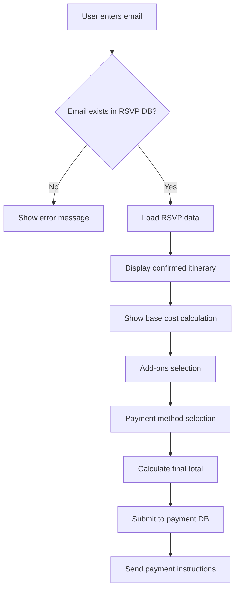

# Argentina Trip Form - Comprehensive Refactoring Analysis Report

## Executive Summary

This document provides a comprehensive analysis of the required refactoring for the Argentina Trip Form React application. The application needs to transition from a **registration system** to an **RSVP confirmation + add-ons selection + payment processing system**.

--------------------------------------------------------------------------------

## Current State Analysis

### **Current Application Structure**

The existing React application is a **registration form** that allows users to:

- Enter personal information (email, name)
- Select trip option (Option 1: $2,250 or Option 2: $2,600)
- Choose accommodation (shared/private room)
- Select optional activities (horseback riding, empanadas cooking, rafting)
- Configure payment options (full/installments, credit/bank transfer)
- Submit data to Google Sheets via Google Apps Script

### **Current Tech Stack**

- **Frontend**: React with hooks (useState, useEffect, custom hooks)
- **Styling**: CSS modules with component-specific stylesheets
- **Backend**: Google Apps Script (doPost endpoint)
- **Database**: Google Sheets
- **Deployment**: Static hosting (Vite build)

### **Current Components Structure**

```
src/
├── App.jsx (main form orchestration)
├── hooks/
│   ├── usePricing.js (pricing calculations)
│   ├── useFormSubmission.js (Google Apps Script integration)
│   ├── useNotifications.js (user feedback)
│   └── useAnimations.js (UI feedback)
├── components/
│   ├── form/
│   │   ├── PersonalInfo.jsx (email + name input)
│   │   ├── TripConfiguration.jsx (option 1 vs 2 selection)
│   │   ├── AccommodationSelector.jsx (private vs shared room)
│   │   ├── ActivitySelection.jsx (optional add-ons)
│   │   └── PaymentOptions.jsx (payment method + schedule)
│   ├── layout/
│   │   ├── Header.jsx
│   │   ├── WelcomeSection.jsx
│   │   └── PricingSummary.jsx
│   └── common/
│       └── NotificationContainer.jsx
└── utils/
    ├── config.js (pricing constants, form fields)
    └── clipboard.js (bank details copying)
```

### **Backend Data Analysis (backend-data.csv)**

#### **Key Columns for New Use Case:**

- **Name**: `Please write your name exactly as it appears on the ID`
- **Plus One Name**: `If traveling with plus one - Please write the name`
- **Email**: `Email (for all trip-related updates and communications)`
- **Option**: `What option are you choosing?` (Option 1, Option 2, PENDING, OTHER)

#### **Boolean Accommodation/Flight Columns:**

- `22 NOV` - Buenos Aires accommodation night
- `23 NOV` - Buenos Aires accommodation night
- `JA3045 AEP - BRC` - Flight Buenos Aires to Bariloche
- `24 NOV` - Bariloche accommodation night
- `25 NOV` - Bariloche accommodation night
- `26 NOV` - Bariloche accommodation night
- `JA3725 BRC MDZ` - Flight Bariloche to Mendoza
- `27 NOV` - Mendoza accommodation night
- `28 NOV` - Mendoza accommodation night
- `JA3073 MDZ AEP` - Flight Mendoza to Buenos Aires
- `29 NOV` - Buenos Aires accommodation night (Option 2 only)

#### **Data Insights:**

- **49 confirmed attendees** with valid RSVPs
- **Option 1**: 25 people (ending in Mendoza Nov 29th)
- **Option 2**: 18 people (includes Salta, ending Dec 2nd)
- **Plus One travelers**: Shared rooms automatically determined
- **Solo travelers**: Need room preference determination
- **PENDING/OTHER cases**: 6 people need follow-up

--------------------------------------------------------------------------------

## Required Refactoring Changes

### **1\. Fundamental App Purpose Change**

**FROM:** Registration/Sign-up form<br>
**TO:** RSVP Confirmation + Add-ons Selection + Payment Processing

### **2\. New User Flow**

1. **Authentication**: Email-based login (not registration)
2. **RSVP Display**: Show confirmed trip details from database
3. **Add-ons Selection**: Choose optional activities
4. **Payment Configuration**: Select payment method
5. **Final Submission**: Submit to new payment database

### **3\. Data Flow Architecture**



### **4\. Key Architectural Changes**

#### **Authentication Layer**

- Replace `PersonalInfo.jsx` with `EmailLogin.jsx`
- Implement email validation against RSVP database
- Handle PENDING/OTHER status users with appropriate messaging

#### **RSVP Confirmation Display**

- Replace `TripConfiguration.jsx` with `RSVPDisplay.jsx`
- Show confirmed itinerary based on boolean columns
- Display calculated base pricing from RSVP selections

#### **Accommodation Logic Update**

- Replace `AccommodationSelector.jsx` with `AccommodationDisplay.jsx`
- Determine room type from plus-one data automatically
- Allow private room upgrade for solo travelers only

#### **Payment Flow Simplification**

- Remove payment schedule options (installments)
- Focus only on payment method (credit vs bank transfer)
- Update final total calculation logic

--------------------------------------------------------------------------------

## Implementation Plan

### **Phase 1: Data Integration & Email Authentication**

#### **New Components Needed:**

1. **`EmailLogin.jsx`** - Replace `PersonalInfo.jsx`
2. **`RSVPDisplay.jsx`** - Replace `TripConfiguration.jsx`
3. **`AccommodationDisplay.jsx`** - Replace `AccommodationSelector.jsx`
4. **`utils/rsvpLoader.js`** - CSV data processing
5. **`utils/rsvpData.json`** - Converted CSV data

#### **Key Changes:**

- Create CSV parser for `backend-data.csv`
- Implement email-based lookup system
- Generate RSVP confirmation display
- Calculate base pricing from RSVP data

### **Phase 2: RSVP Display Logic**

#### **Data Mapping Requirements:**

```javascript
// Example RSVP structure after lookup
const rsvpData = {
  name: "John Doe",
  email: "john@example.com", 
  option: "Option 1", // or "Option 2"
  plusOneName: "Jane Doe", // if traveling with plus one
  isSharedRoom: true, // based on plus one data
  itinerary: [
    { date: "22 NOV", type: "accommodation", location: "Buenos Aires", included: true },
    { date: "23 NOV", type: "accommodation", location: "Buenos Aires", included: true },
    { date: "JA3045", type: "flight", route: "AEP - BRC", included: true },
    { date: "24 NOV", type: "accommodation", location: "Bariloche", included: true },
    // ... etc
  ],
  baseCost: 2250 // calculated from selected nights + flights
}
```

#### **Pricing Logic Update:**

- Parse boolean columns to determine included services
- Calculate base cost from confirmed accommodations/flights
- Apply itemized pricing: nights + flights + room type

### **Phase 3: Add-ons & Payment Flow**

#### **Modified Components:**

- **Keep `ActivitySelection.jsx`** - Minor updates for new flow
- **Update `PaymentOptions.jsx`** - Remove schedule options, focus on method
- **Update `PricingSummary.jsx`** - Show RSVP base + addons + total

#### **New Submission Flow:**

```javascript
// New submission data structure
const paymentSubmission = {
  email: "user@email.com",
  rsvpConfirmed: true,
  rsvpBaseCost: 2250, // calculated from RSVP
  selectedAddons: [
    { id: "horseback", name: "Horse Back Riding", price: 45 },
    { id: "cooking", name: "Empanadas Cooking Class", price: 140 }
  ],
  addonsTotal: 185, // calculated
  paymentMethod: "credit", // or "bank"
  processingFee: 97.4, // 2.85% if credit
  finalTotal: 2532.4,
  submissionTimestamp: "2025-01-XX"
}
```

### **Phase 4: Backend Integration**

#### **Google Apps Script Updates:**

1. **New Sheet**: "Payment Confirmations"
2. **Updated doPost()**: Handle payment-focused submissions
3. **RSVP Lookup**: Potentially implement server-side CSV lookup
4. **Email Integration**: Send payment links/instructions

--------------------------------------------------------------------------------

## Technical Requirements

### **Data Processing Needs**

#### **CSV Integration Options:**

1. **Client-side**: Parse CSV in browser (simple, immediate)
2. **Server-side**: Upload CSV to Google Sheets, lookup via API
3. **Hybrid**: Static JSON conversion of CSV for faster lookup

**Recommended Approach**: Convert CSV to JSON configuration file for client-side lookup

#### **Example JSON Structure:**

```json
{
  "participants": [
    {
      "email": "dzhang6@stanford.edu",
      "name": "Danielle Zhang", 
      "plusOne": "Christopher He",
      "option": "Option 1",
      "itinerary": {
        "22_NOV": true,
        "23_NOV": true,
        "JA3045_AEP_BRC": true,
        "24_NOV": true,
        "25_NOV": true,
        "26_NOV": true,
        "JA3725_BRC_MDZ": true,
        "27_NOV": true,
        "28_NOV": true,
        "JA3073_MDZ_AEP": true,
        "29_NOV": false
      }
    }
  ]
}
```

### **Pricing Structure Updates**

#### **Current Pricing Logic** (needs updating):

```javascript
// OLD: Fixed base prices
const basePrice = tripOption === 1 ? 2250 : 2600;

// NEW: Calculated from RSVP data  
const basePrice = calculateRSVPCost(userRSVP.itinerary);
```

#### **New Pricing Components:**

- **Accommodation nights**: $X per night per person
- **Flights**: $Y per flight per person
- **Room type**: +$350 for private (if not shared in RSVP)
- **Add-ons**: Existing activity pricing
- **Payment processing**: 2.85% credit card fee

#### **Pricing Configuration Needed:**

```javascript
const RSVP_PRICING = {
  accommodations: {
    "buenos_aires_night": 80,
    "bariloche_night": 90, 
    "mendoza_night": 85,
    "salta_night": 75
  },
  flights: {
    "AEP_BRC": 180,
    "BRC_MDZ": 160,
    "MDZ_AEP": 170
  },
  upgrades: {
    "private_room": 350
  }
};
```

### **Error Handling**

#### **New Error Cases:**

- Email not found in RSVP database
- PENDING/OTHER status users
- Incomplete RSVP data
- Payment processing failures
- Invalid CSV data format

#### **Error Handling Strategy:**

```javascript
const handleEmailLookup = (email) => {
  const participant = rsvpData.find(p => p.email === email);

  if (!participant) {
    return { error: "Email not found in RSVP database" };
  }

  if (participant.option === "PENDING") {
    return { error: "Your RSVP is still pending. Please contact organizers." };
  }

  if (participant.option === "OTHER") {
    return { error: "Please contact organizers for your custom arrangement." };
  }

  return { success: true, data: participant };
};
```

--------------------------------------------------------------------------------

## Migration Strategy

### **Recommended Implementation Order:**

#### **1\. Data Preparation** (1-2 days)

- Convert CSV to JSON lookup table
- Create pricing calculation functions
- Test data parsing logic
- Handle edge cases in data

#### **2\. Authentication Layer** (2-3 days)

- Build email login component
- Implement RSVP lookup
- Handle edge cases (PENDING, not found)
- Add loading states and error handling

#### **3\. RSVP Display** (2-3 days)

- Create confirmation display component
- Build itinerary visualization
- Calculate base pricing from RSVP
- Add accommodation details display

#### **4\. Payment Flow** (2-3 days)

- Update add-ons selection (minor changes)
- Modify payment options (remove installments)
- Update pricing summary (show breakdown)
- Update form validation logic

#### **5\. Backend Integration** (2-3 days)

- Create new Google Apps Script endpoints
- Implement payment submission handling
- Set up email confirmation system
- Create new Google Sheet structure

#### **6\. Testing & Deployment** (1-2 days)

- End-to-end testing with real data
- Edge case validation
- User acceptance testing
- Production deployment

**Total Estimated Effort**: 10-16 days

--------------------------------------------------------------------------------

## Critical Considerations

### **Data Quality Issues:**

- Some RSVP entries have PENDING status
- Missing plus-one names in some entries
- Email format inconsistencies
- Need manual review of OTHER category
- Duplicate email entries for couples

### **Business Logic Questions:**

- How to handle PENDING users?
- Private room pricing for solo travelers?
- Refund/modification policies for add-ons?
- Payment deadline enforcement?
- What to do with OTHER category users?

### **Technical Challenges:**

- CSV parsing and error handling
- Real-time pricing calculations
- Email verification security
- Payment link generation
- Data synchronization between sheets

### **User Experience Considerations:**

- Clear messaging for rejected emails
- Intuitive RSVP confirmation display
- Transparent pricing breakdown
- Simple add-ons selection process
- Clear payment instructions

--------------------------------------------------------------------------------

## Conclusion

This refactoring represents a fundamental shift from a registration system to a confirmation + payment system. The changes require:

1. **Complete data flow redesign** - from registration to RSVP lookup
2. **New authentication pattern** - email-based instead of form-based
3. **Dynamic pricing calculation** - based on individual RSVP selections
4. **Simplified payment flow** - focused on add-ons and payment method
5. **New backend integration** - separate payment tracking system

The project maintains the existing aesthetic and core functionality while completely changing the underlying business logic and user journey. Careful attention to data migration, error handling, and user experience will be critical for successful implementation.

--------------------------------------------------------------------------------

## Appendix

### **Files Requiring Major Changes:**

- `src/App.jsx` - Updated flow and component orchestration
- `src/components/form/PersonalInfo.jsx` → `EmailLogin.jsx`
- `src/components/form/TripConfiguration.jsx` → `RSVPDisplay.jsx`
- `src/components/form/AccommodationSelector.jsx` → `AccommodationDisplay.jsx`
- `src/hooks/usePricing.js` - Complete pricing logic overhaul
- `src/hooks/useFormSubmission.js` - New submission format
- `google-apps-script.js` - New endpoint for payment submissions

### **New Files Required:**

- `src/utils/rsvpLoader.js` - CSV/JSON data processing
- `src/utils/rsvpData.json` - Converted participant data
- `src/components/auth/EmailLogin.jsx` - Authentication component
- `src/components/display/RSVPDisplay.jsx` - Confirmation display
- `src/hooks/useRSVPLookup.js` - RSVP data management

### **Files Requiring Minor Changes:**

- `src/components/form/ActivitySelection.jsx` - Minor updates
- `src/components/form/PaymentOptions.jsx` - Remove installment options
- `src/components/layout/PricingSummary.jsx` - Update breakdown display
- `src/utils/config.js` - Add RSVP pricing configuration
